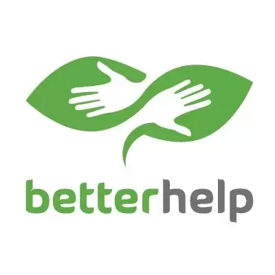
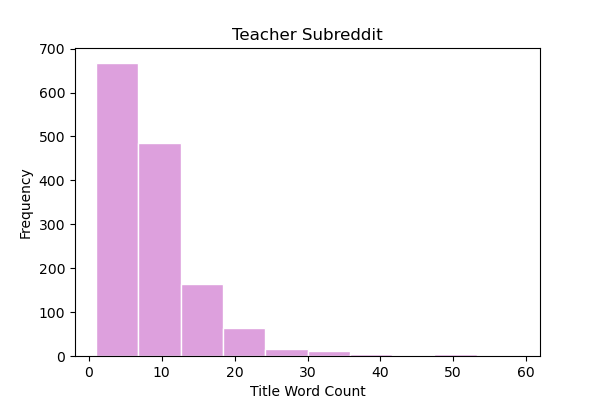
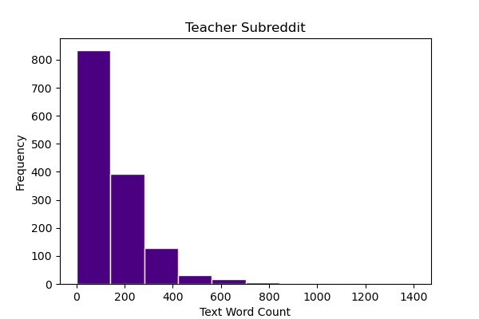
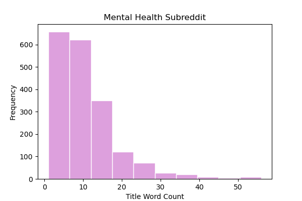
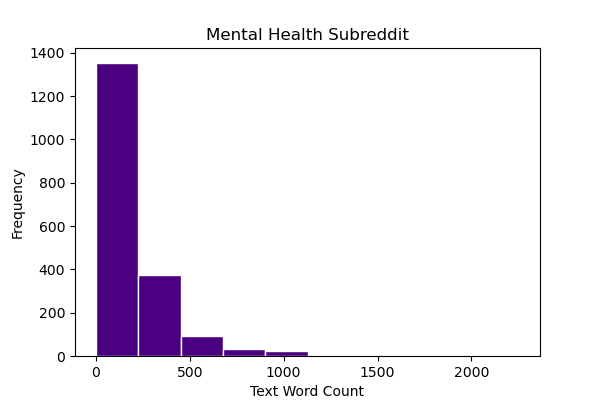
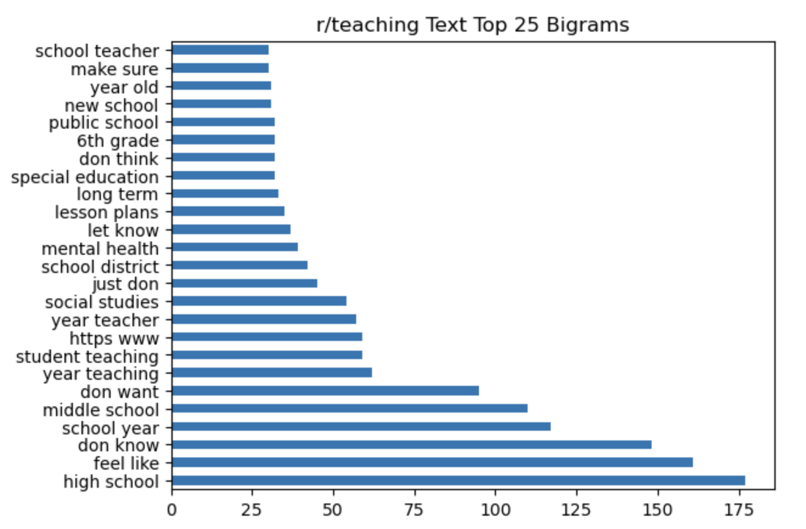
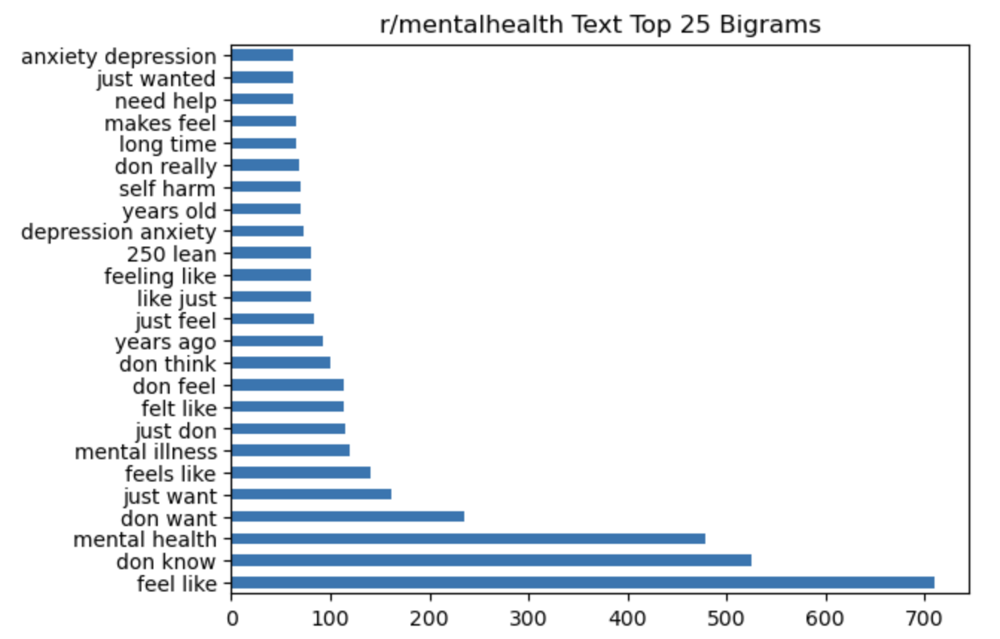
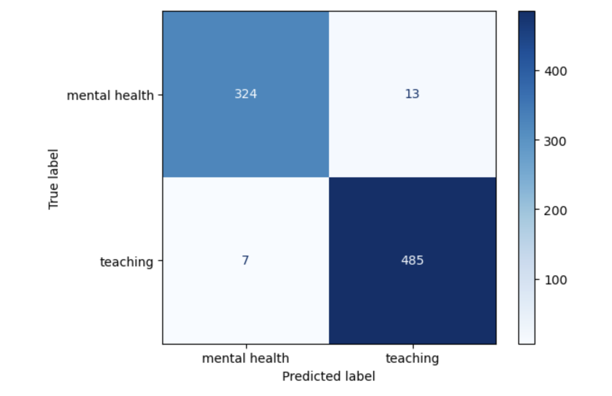

# Project 3 - Web APIs & NLP


_Note: The reference to collaboration with BetterHelp is fictional and was solely intended for project-related purposes._

<p align="center">
  
</p>

Teaching is a rewarding yet demanding profession, a fact I can personally confirm from my experience as a high school math teacher. The combination of long working hours and a substantial workload makes it easy for educators to succumb to "teacher burnout." According to _[Psychology Today](https://www.psychologytoday.com/intl/blog/high-octane-women/201311/the-tell-tale-signs-of-burnout-do-you-have-them)_, burnout is characterized as "a state of chronic stress that leads to physical and emotional exhaustion, cynicism, detachment, and feelings of ineffectiveness and lack of accomplishment".

Without adequate support, teachers risk becoming overworked and neglecting their mental and physical well-being. Recognizing this challenge, **[BetterHelp](https://www.betterhelp.com/)**, an online counseling platform with a mission to make "professional therapy accessible, affordable, and convenient", is launching the **Educator Alliance Initiative (EAI)**. This initiative aims to provide free counseling services to educators, aiming to mitigate the prevalent issue of teacher burnout in the education system.

Once this initiative goes live, the organization is expecting a mass influx in inquires. With the expected surge in requests, it is crucial for the inquiry intake department to quickly, efficiently, and accurately assess eligibility of the candidate into the _EAI_. As part of this initiative, _BetterHelp_ is developing a model, and they have sought my assistance in its construction. The model's purpose is to analyze incoming inquiries and predict, with a minimum accuracy of 90%, whether the individual qualifies for participation in the Educator Alliance Initiative. 


# File Directory

```
Web APIs & NLP
|__ code
|   |__ 01-reddit-praw
|     |__mentalhealth.ipynb
|     |__teaching.ipynb
|   |__ 02 - Cleaning.ipynb   
|   |__ 03 - EDA.ipynb
|   |__ 04 - Modeling.ipynb     
|__ data
|   |__ cleaned_mentalhealth_posts.csv
|   |__ cleaned_teaching_posts.csv
|   |__ combo.csv
|   |__ mentalhealth_posts.csv
|   |__ teaching_posts.csv
|__ images
|   |__ BetterHelp_logo.jpg.webp
|   |__ Mentalhealth_Text_Bigram.png
|   |__ Mentalhealth_Text_Sentiment.png
|   |__ Mentalhealth_Text_Word_Count.png
|   |__ Mentalhealth_Title_Word_Count.png
|   |__ Model_Confusing_Matrix.png
|   |__ Teacher_Text_Word_Count.png
|   |__ Teacher_Title_Word_Count.png
|   |__ Teaching_Text_Bigram.png
|   |__ Teaching_Text_Sentiment.png
|__ README.md
```


# Outside Research

Ensuring proper support for an individual's mental well-being is crucial. Unfortunately, educators often find themselves lacking the necessary support. The onset of the Covid-19 pandemic in early 2020 brought attention to a significant issue – a considerable number of school districts across the United States do not provide any form of insurance to their educators. This firsthand observation is consistent with my personal experience, as none of the schools I've worked for offered insurance coverage to their staff members.

According to Sterling Price, the senior research analyst at ValuePenguin, this problem is not a unique experience. In [his article](https://www.valuepenguin.com/teacher-benefit-study#rate), Sterline notes that nearly half a million teachers in the country are without insurance. This situation leaves educational professionals to bear the cost of health services, be it for mental or physical well-being, out of their own pockets, often on a salary that is already modest.

As highlighted by [Mira](https://www.talktomira.com/post/how-much-does-therapy-cost-without-health-insurance-in-2021), a modern benefits provider, therapy sessions without health insurance can be a significant financial burden. In the year 2023, "on average, a therapy session costs between \\$138 - \\$300 for an hour-long session for those who do not have health insurance". For educators without insurance, this could amount to upwards of $1,200 per month for just one session per week. Such expenses become a prohibitive factor, making it challenging for educators to access essential professional mental health assistance.

Below are teacher burnout statistics (supplied by [ThinkImpact](https://www.thinkimpact.com/teacher-burnout-statistics/#:~:text=New%20teachers%20are%20leaving%20their,in%20other%20countries%20are%20quitting.)) that have captured my attention and raised concerns:

- A survey showed that 51% of teachers fear for their mental and physical health when teaching.

- 90% of teachers reported that their feelings of burnout were a serious problem for them and their job.

- Between February 2020 – May 2022, it was estimated that over 300.000 public school teachers and other staff quit due to burnout.

- Up to 30% of new teachers are quitting their job within 5 years of teaching.

- The amount of teachers quitting or retiring has risen by 55% in the last 30 years.

- New teachers are leaving their jobs within 5 years of teaching in percentages as high as 30%.

- 8% of US teachers are quitting their careers, while only 3% to 4% of teachers in other countries are quitting.

- 86% of teachers reported seeing far more teachers quit and retire since 2020 than they had ever seen before.


# Data Dictionary

|Name|Dataset|Description|
|---|---|---|
|**mentalhealth**|mentalhealth_post.csv| 3991 posts pulled from Reddit's "mentalhealth" subreddit.
|**teaching**|teaching_post.csv| 3463 posts pulled from Reddit's "teaching" subreddit.
|**cleaned_mentalhealth** | cleaned_mentalhealth_posts.csv | Removed nulls from mentalhealth dataset
|**cleaned_teaching** | cleaned_teaching_posts.csv | Removed nulls from teaching dataset
|**combo** | combo.csv | Concatonated version of cleaned_mentalhealh and cleaned_teaching


# Executive Summary

In order to distinguish between educators seeking mental health services and other non-educator customers, I sought insights from relevant sources on each topic. The Teaching subreddit [(r/teachihng)](https://www.reddit.com/r/teaching/) serves as a community where educators gather to exchange educational news, share tips and tricks, and seek advice or vent about the challenges of being a teacher in today's society. This subreddit boasts a membership of over 120,000 individuals. On the other hand, the Mentalhealth subreddit [(r/mentalhealth)](https://www.reddit.com/r/mentalhealth/) provides a platform for discussions, venting, support, and information-sharing related to mental health (illness and wellness), currently hosting a community of over 417,000 members.

A total of over 7,400 posts, were extracted from the two subreddits, which encompassed both titles and text of each post. To refine these datasets, rows with null and duplicated entries were eliminated. Null values were primarily associated with posts containing attached pictures or videos, rendering them unsuitable for this specific scenario. Following this data cleansing process, the teaching and mental health datasets yielded 1,420 and 1,893 valid posts, respectively. This distribution reflects a nearly even split between the two datasets, with each contributing significantly to the overall collection.

During the exploratory data analysis (EDA) process, the two subreddits were examined individually. The initial aspect investigated was the distribution of the length and word counts in both the titles and post text. The distribution of word counts specifically for titles and text is illustrated below:

<p align="center">
  
</p>

<p align="center">
  
</p>

<p align="center">
  
</p>

<p align="center">
  
</p>


As evident in the images above, all four distributions exhibit a right skew, indicating that excessively long titles and texts are not the majority. However, it is apparent that individuals in the mental health subreddit tend to compose longer texts.


This prompted further investigation into the specific words used. Initially, the top 25 most common singular words were examined. However, upon closer inspection, the top 25 bigrams from each subreddit were deemed to offer more insightful information. These bigrams are presented below:

<p align="center">
  
</p>

<p align="center">
  
</p>


The visuals above reveal that the phrases "mental health" and "feel like" emerge as prominent bigrams in both subreddits, indicating they are prevalent topics of discussion among the community members. This prompted an exploration of the overall mood within these Reddit threads, leading to a sentiment analysis. A score of 1 indicates a highly positive sentiment, while a score of -1 indicates a strongly negative sentiment. The table below presents these scores. Although the mental health scores are distinctly negative, the teaching scores are not significantly better, suggesting an overall negative sentiment prevailing in both subreddits.


|teaching title|teaching text|mentalhealth title|mentalhealth text|
|---|---|---|---|
|0.00915549295774648|0.313248661971831|-0.08286455361859482|-0.029222345483359734|


Following the completion of EDA, I concatenated the two distinct dataframes into a single comprehensive dataframe. Subsequently, various models were applied to this combined dataframe, incorporating CountVectorizer, TfidfVectorizer, MultinomialNB, and LogRegression. These models were separately tested on titles, texts, and the amalgamation of both, exploring multiple parameters.

The highest accuracy score achieved in the title-only tests was 0.872, and recognizing the potential for improvement, I pursued further refinement. For text-only analysis, the score significantly rose to 0.967, indicating a substantial enhancement. It became apparent that a larger corpus of text for the model to learn from yielded better results. Consequently, running tests on the combination of both title and text resulted in a score of 0.976. Notably, all these models surpassed the baseline model, which scored an accuracy of 0.571.

The most effective model utilized TfidfVectorizer as the pre-processor and Multinomial Naive Bayes as the model when applied to the combined data of both titles and texts.

To delve into the details, TfidfVectorizer tokenizes, counts, and normalizes the data, facilitating the streamlining of natural language processing. Naive Bayes models are commonly favored for classification problems due to their speed and frequent outperformance of more intricate models. The choice of Multinomial Naive Bayes was dictated by the nature of the data, which comprised positive integers. The optimal parameters for this model included an n-gram range of (1,2), indicating that the most effective model was constructed based on both unigrams and bigrams. This observation piqued my interest, especially in light of my earlier statement where I highlighted the perceived greater insightfulness of bigrams. Additionally, this model eliminated all English stopwords.

The model demonstrated a training score of 0.9762 and a testing score of 0.9759, translating to a mean accuracy of 97.59%. Impressive! But what does the 2.41% inaccuracy entail? A closer look at the predicted test values led to the generation of the following confusion matrix:

<p align="center">
  
</p>

In this matrix, it becomes apparent that out of the 829 predictions made on the testing dataset, only 20 were inaccuracies. Among these inaccuracies, 13 are categorized as "False Positives," signifying instances where posts were predicted to be from r/teaching but actually belonged to r/mentalhealth. The remaining 7 inaccuracies are labeled as "False Negatives," indicating posts predicted to be from r/mentalhealth but originating from r/teaching. Could these same errors be made by humans? After a thorough examination of the incorrect predictions, I believe so. Below is an example of one such incorrect prediction:
> "Giving up. I quit my position and I don't know what's next. The pressure of this job is tolerable, if I was working towards something. As it is now, I feel like I am joining a game of Monopoly 20 turns after everyone else. Just roll the dice and pay rent, that's my only option. I just want to stop. I want to say it's a mental health crisis, but the reality is, my poor mental health comes from social and financial poverty. I love Teaching. I love the job, really. But it's hard to keep rolling the dice, knowing I can't buy shit. I just work and work and pay for other people's shit. The only rent free spot on the board is jail. I've been thinking about how I could save for retirement and my conclusion is I will not be able to retire. No matter how much personal wealth I accumulate, without a house I will be relying on the generosity of others when I am too old to work. There is not future in this and I hat being told to roll the dice by people who own everything on the board. Just roll the dice, that's how you win! They say unsarcasticly. I want to give up. So I gave up. Now I am depressed."

This example was predicted to come from r/mentalhealth when in actuality it derived from r/teaching. Key words and phrases such as "giving up", "mental health criss", "my poor mental health", "now I am depressed", could easily be interpreted to come from a mental health forum, even by a quick glance from a human. Due to this, the 2.41% inaccuracy is acceptable and the model is successful. 


### Conclusion:

To summarize, Better Help can employ the successful model to categorize incoming customers into two groups: those eligible for the Educator Alliance Initiative and those who are not. The model boasts a remarkable accuracy of 97.59%. The 2.41% inaccuracy leads to two potential scenarios:

- False Positives: predicted to be from r/teaching, when in reality they were from r/mentalhealth. In this case, a customer would be placed into the initiative when they should not be. Conflict could arise if this customer is started in the program for free health care and then removed. To resolve this issue, all those who are identified as eligible should be requitred to submit their teaching credentials and documents for processing. 

- False Negatives: predicted to come from r/mentalhealth but they actually came from r/teaching. In this case, the customer should be included in the initiative and is not. Again, a simple submission of credentials and documents could resolve this issue and allow the customer to proceed with the program. 

With the assistance of _Better Help_'s Educator Alliance Initiative, education professionals around the nation can start receiving the support they need to help them continue building a better tomorrow for all of us. Thank you for taking the time to read my insights! Your engagement is appreciated, and I hope you found the information valuable.


# Sources

- [Psychology Today](https://www.psychologytoday.com/intl/blog/high-octane-women/201311/the-tell-tale-signs-of-burnout-do-you-have-them)

- [Better Help](https://www.betterhelp.com/)

- [ValuePenguin](https://www.valuepenguin.com/teacher-benefit-study#rate)

- [Mira](https://www.talktomira.com/post/how-much-does-therapy-cost-without-health-insurance-in-2021)

- [ThinkImpact](https://www.thinkimpact.com/teacher-burnout-statistics/#:~:text=New%20teachers%20are%20leaving%20their,in%20other%20countries%20are%20quitting.)
 
- [Teaching Subreddit](https://www.reddit.com/r/teaching/)

- [Mental Health Subreddit](https://www.reddit.com/r/mentalhealth/)

-[General Assembly Notes & Lessons](https://generalassemb.ly/)